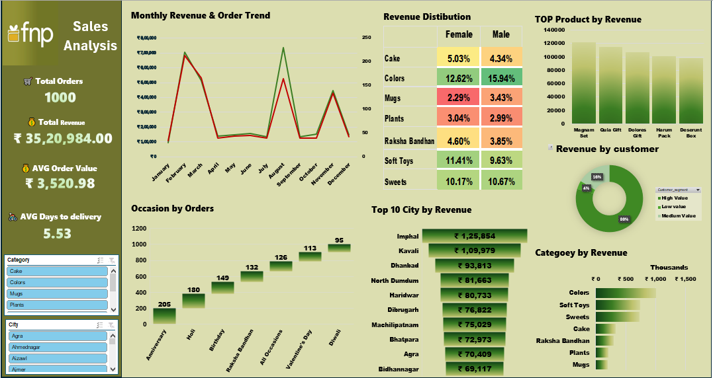

# FNP-Sales-Analysis

## Project Overview

This project presents an interactive Sales Analysis Dashboard built in Excel to analyze business performance across customers, products, locations, and time.

The dashboard enables stakeholders to track key metrics, identify trends, and make data-driven decisions efficiently.

## 📁 Dataset

The project is built using three datasets:

Customers – Customer details and segmentation

Orders – Transaction-level sales data

Products – Product categories and details

## ⚙️ Tools & Techniques Used

Excel Tables for structured data

Power Query Editor for Data Cleaning and transforming

Power Pivot for Data Modeling

Pivot Tables for aggregation

Pivot Charts for visualization

XLOOKUP for data mapping

SUMIFS / COUNTIFS for KPI calculations

Slicers for interactivity

Conditional Formatting for insights

## 📈 Key KPIs

📦 Total Orders: 1000

💰 Total Revenue: ₹ 35,20,984

📊 Average Order Value: ₹ 3,520.98

🚚 Avg Delivery Time: 5.53 days

## 📊 Dashboard Features

**📅 Monthly Revenue & Order Trend**

Tracks revenue and order volume over time

Helps identify seasonal patterns and peak months

**🎁 Revenue Distribution**

Category-wise contribution split by gender

Highlights customer preference trends

**🏆 Top Products by Revenue**

Identifies best-performing products

Helps in inventory and marketing decisions

**🌍 Top Cities by Revenue**

Highlights high-performing locations

Useful for regional strategy planning

🎯 Occasion-Based Orders

Shows demand across events like Anniversary, Raksha Bandhan, Diwali, etc.

**👥 Customer Segmentation**

Categorizes customers into:

High Value

Medium Value

Low Value

**📦 Category Performance**

Compares revenue contribution across product categori

**🎛️ Interactivity**

Dynamic filtering using Category slicer

City-level filtering

Fully interactive dashboard experience

## **💡 Key Insights**

A significant portion of revenue comes from high-value customers (~80%)

Certain months show strong sales spikes, indicating seasonal demand

Products like gift sets and cakes generate the highest revenue

Cities like Imphal and Kavali lead in revenue contribution

Occasions like Anniversaries and Raksha Bandhan drive high order volumes

## **🎯 Business Impact**

This dashboard helps:

Monitor overall sales performance

Identify top customers and products

Understand seasonal trends

Improve marketing and sales strategies

## **🖼️ Dashboard Preview**

